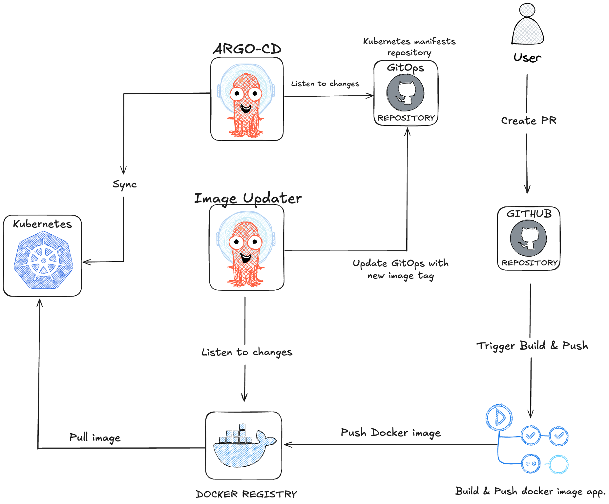

## Complete Process Flow

1. **GitHub Actions**
   - ✓ Detect change in `.version`;
   - ✓ Login to Docker Hub;
   - ✓ Build image;
   - ✓ Push tag that's in `.version` file;

2. **Argo Image Updater**
   - ✓ Detect new version on Docker Hub;
   - ✓ Update manifest in Git;

3. **ArgoCD**
   - ✓ Syncs to cluster;
   - ✓ Deploy new version;
   - ✓ Rollback to previous version if new version is not working;

## Automatic Update Flow



## How to update version

1. Update version in `.version` file;
2. Commit and push to GitHub;
3. GitHub Actions will build and push new version to Docker Hub;
4. Argo Image Updater will update manifest creating this file `.argocd-source-foobar.yaml`;
5. To make sure we don't miss any version changes, I've created the script `update-version.sh`. See [Kubernetes Version Sync Script](../../kubernetes/README.md#kubernetes-version-sync-script).

## [UPDATE] Kustomization Configuration

Instead of using `.argocd-source-foobar.yaml`, we're going to manage images directly in `kustomization.yaml`.
See [kustomization.yaml](../kubernetes/kustomization.yaml) for more details.    https://github.com/tbernacchi/traefik-labs/blob/main/kubernetes/kustomization.yaml

## Argo Image Updater Configuration

```
kubectl annotate application foobar -n argocd \
    argocd-image-updater.argoproj.io/git-branch="main" \
    argocd-image-updater.argoproj.io/image-list="myalias=ambrosiaaaaa/foobar-api" \
    argocd-image-updater.argoproj.io/myalias.pull-secret="dockerhub-secret" \
    argocd-image-updater.argoproj.io/myalias.update-strategy="semver" \
    argocd-image-updater.argoproj.io/write-back-method="git:secret:argocd/git-creds" \
    argocd-image-updater.argoproj.io/write-back-target="kustomization" \
    --overwrite
```

```
kubectl get application foobar -n argocd -o jsonpath='{.metadata.annotations}' | jq
{
  "argocd-image-updater.argoproj.io/git-branch": "main",
  "argocd-image-updater.argoproj.io/image-list": "myalias=ambrosiaaaaa/foobar-api",
  "argocd-image-updater.argoproj.io/myalias.pull-secret": "dockerhub-secret",
  "argocd-image-updater.argoproj.io/myalias.update-strategy": "semver",
  "argocd-image-updater.argoproj.io/write-back-method": "git:secret:argocd/git-creds",
  "argocd-image-updater.argoproj.io/write-back-target": "kustomization"
}
```

## Auto-sync Configuration

```
kubectl patch application foobar -n argocd --type merge -p '{"spec":{"syncPolicy":{"syncOptions":["CreateNamespace=true","PruneLast=true","Validate=false"]}}}'
```

```
kubectl get application foobar -n argocd -o jsonpath='{.spec.syncPolicy}' | jq
{
  "automated": {
    "prune": true,
    "selfHeal": true
  },
  "syncOptions": [
    "CreateNamespace=true",
    "PruneLast=true",
    "Validate=false"
  ]
}
```
